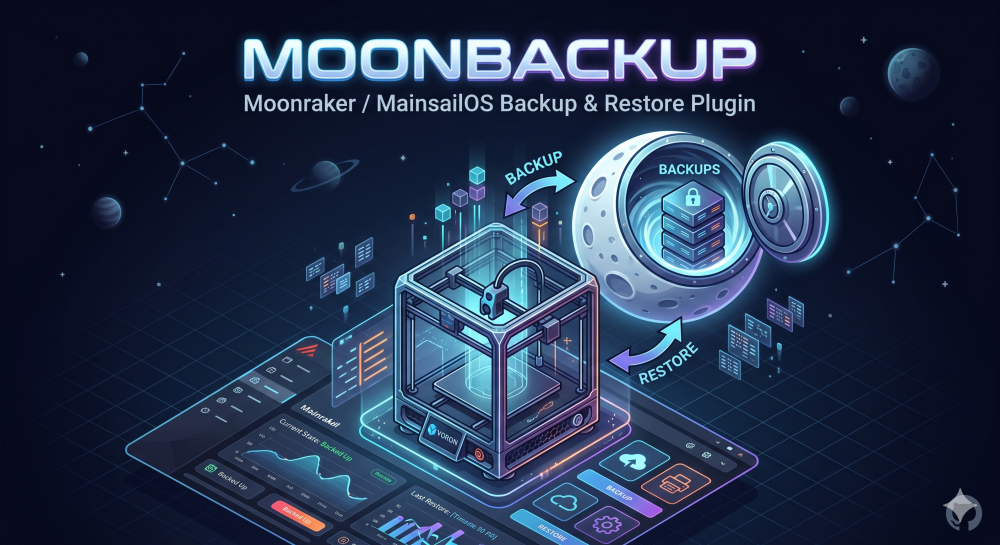

# MoonBackup



A comprehensive backup and restore solution for VORON 3D printers running MainsailOS with Moonraker.

## Features

- **Full System Backup**: Backup your entire home directory or select specific directories
- **Multiple Backup Types**: Full or incremental backups
- **Multiple Destinations**: Local storage, GitHub, SCP to remote server
- **Selective Backup**: Choose what to include/exclude (timelapse, gcodes, logs, etc.)
- **Moonraker Integration**: Stops Moonraker before database backup and restarts it afterward
- **Email Notifications**: Get notified about backup status with config file attachment
- **Restore Functionality**: Easy restore from any backup source
- **WebUI Macros**: Start backups directly from Moonraker WebUI

## Installation

### Prerequisites

- MainsailOS or any Debian-based system running Moonraker
- G-Code Shell Command must be installed (required for RUN_SHELL_COMMAND)
- git (for GitHub backups)
- tar, gzip (for compression)
- Optional: sendmail, mail, or swaks (for email notifications)

### Install G-Code Shell Command (if not installed)

G-Code Shell Command is typically installed via KIAUH:

```bash
# Run KIAUH
~/kiauh/kiauh.sh
# Select: [6] Moonraker
# Select: [4] Install gcode_shell_command
```

Then restart Moonraker:
```bash
sudo systemctl restart moonraker
```

### Install MoonBackup

```bash
# Clone or download MoonBackup to your home directory
git clone https://github.com/LionBit76/MoonBackup.git ~/MoonBackup

# Run the installer
cd ~/MoonBackup
bash installer.sh
```

The installer will:
1. Check for G-Code Shell Command
2. Create the ~/Backup directory
3. Copy configuration files to ~/printer_data/config/
4. Register macros in moonraker.conf

## Configuration

Edit the configuration file at `~/printer_data/config/MoonBackup.cfg`

### Backup Sources

Set to `1` to include, `0` to exclude:

```ini
BACKUP_HOME=1              # Entire home directory
BACKUP_TIMELAPSE=0        # Timelapse directory (can be very large)
BACKUP_GCODES=1           # G-Code files
BACKUP_PRINTER_DATA=1    # Printer configuration directory
BACKUP_LOGS=1            # Log files
BACKUP_DATABASE=1        # Moonraker database
BACKUP_SYSTEM=1          # System configuration
BACKUP_MOONRAKER=1       # Moonraker configuration
BACKUP_KLIPPER=1         # Klipper configuration
BACKUP_WEBCAM=1          # Webcam configuration

CUSTOM_INCLUDE=""         # Additional directories to include
CUSTOM_EXCLUDE="Backup MoonBackup"  # Directories to exclude
```

### Backup Type

```ini
BACKUP_TYPE="full"        # full or incremental
INCREMENTAL_FULL_KEEP=3   # Number of full backups to keep
```

### Backup Destinations

Enable/disable backup destinations:

```ini
DEST_LOCAL=1              # Local backup to ~/Backup
DEST_GITHUB=0            # Backup to GitHub
DEST_SCP=0               # Backup via SCP
```

### Local Backup Settings

```ini
LOCAL_BACKUP_DIR="$HOME/Backup"
LOCAL_MAX_BACKUPS=5      # Maximum number of backups to keep (0 = unlimited)
LOCAL_COMPRESSION=6      # Compression level (0-9)
```

### GitHub Backup Settings

```ini
GITHUB_TOKEN=""          # Personal Access Token (classic)
GITHUB_REPO=""           # Repository in format: username/repo-name
GITHUB_BRANCH="main"     # Branch to push backups to
GITHUB_COMMIT_MSG="MoonBackup - %DATE%"
```

To create a GitHub token:
1. Go to https://github.com/settings/tokens
2. Click "Generate new token (classic)"
3. Give it a name (e.g., "MoonBackup")
4. Select the `repo` scope
5. Click "Generate token" and copy the token

### SCP Backup Settings

```ini
SCP_HOST=""              # Remote server hostname or IP
SCP_USER=""              # Remote server username
SCP_PATH="/backups/voron" # Remote directory path
SCP_PORT=22               # SSH port
SCP_KEY=""               # Private key file path (optional)
```

### Email Notification Settings

```ini
EMAIL_ENABLED=0          # Enable email notifications
EMAIL_TO="your-email@example.com"
EMAIL_FROM="moonbackup@voron.local"
EMAIL_SMTP="smtp.example.com"
EMAIL_PORT=587
EMAIL_USER=""           # SMTP username (if required)
EMAIL_PASSWORD=""       # SMTP password (if required)
EMAIL_USE_TLS=1          # Use TLS
EMAIL_USE_STARTTLS=1     # Use STARTTLS
```

### Moonraker Control

```ini
STOP_MOONRAKER_FOR_DB=1  # Stop Moonraker before database backup
MOONRAKER_SERVICE="moonraker"
MOONRAKER_STOP_WAIT=10   # Wait time for Moonraker to stop
MOONRAKER_START_WAIT=15  # Wait time for Moonraker to start
```

### Backup Naming

```ini
BACKUP_PREFIX="voron-backup"
BACKUP_INCLUDE_DATE=1    # Include date in backup name
BACKUP_DATE_FORMAT="%Y%m%d-%H%M%S"
```

## Usage

### Via Moonraker WebUI

After installation, the following macros will be available in Moonraker WebUI:

- **BACKUP**: Start a backup
- **RESTORE**: Restore from the latest backup
- **BACKUP_STATUS**: Check if a backup is currently running

### Via Command Line

```bash
# Start a backup
bash ~/printer_data/config/moonbackup.sh

# Check backup status
bash ~/printer_data/config/moonbackup.sh --status

# Restore from latest local backup
bash ~/printer_data/config/restore.sh

# List available backups
bash ~/printer_data/config/restore.sh list

# Restore from specific local backup
bash ~/printer_data/config/restore.sh local /path/to/backup.tar.gz

# Restore from GitHub
bash ~/printer_data/config/restore.sh github

# Restore from SCP
bash ~/printer_data/config/restore.sh scp
```

## Backup Files

Backups are stored as compressed tar archives with the following naming convention:

```
<BACKUP_PREFIX>_<DATE>.<ext>
```

Example:
```
voron-backup_20240115-143022.tar.gz
```

Local backups are stored in `~/Backup/` by default.

## Restore Process

The restore process:
1. Stops Moonraker (if configured)
2. Extracts the backup to a temporary directory
3. Copies files back to their original locations
4. Restarts Moonraker (if it was stopped)
5. Sends notification email (if configured)

**Important**: After restoring, you may need to restart additional services depending on what was restored.

## Troubleshooting

### Check Log Files

```bash
# Backup logs
tail -f ~/printer_data/logs/moonbackup.log

# Restore logs
tail -f ~/printer_data/logs/moonbackup-restore.log
```

### Common Issues

**G-Code Shell Command not installed**
```
ERROR: G-Code Shell Command is not installed!
```
Install it with:
```bash
sudo apt update
sudo apt install -y moonraker-gcode-shell-command
sudo systemctl restart moonraker
```

**Moonraker won't stop**
```
WARN: Moonraker did not stop cleanly
```
Increase the wait time in configuration:
```ini
MOONRAKER_STOP_WAIT=30
```

**Email not sending**
Make sure you have sendmail, mail, or swaks installed:
```bash
sudo apt install -y sendmail
```

### Verify Configuration

```bash
# Check if config file is valid
bash -n ~/printer_data/config/MoonBackup.cfg && echo "Config is valid" || echo "Config has errors"
```

## File Structure

```
~/MoonBackup/
├── installer.sh           # Installation script
├── moonbackup.sh         # Main backup script
├── restore.sh            # Restore script
├── config/
│   └── MoonBackup.cfg    # Default configuration
└── README.md             # This file

~/printer_data/config/
├── MoonBackup.cfg        # Active configuration
├── moonbackup.sh         # Copy of main backup script
└── restore.sh            # Copy of restore script

~/Backup/                 # Local backups (excluded from backup)
└── voron-backup_*.tar.gz

~/printer_data/logs/
├── moonbackup.log        # Backup log
└── moonbackup-restore.log # Restore log
```

## Contributing

1. Fork the repository
2. Create a feature branch
3. Make your changes
4. Submit a pull request

## License

MIT License

## Support

For issues and questions, please open an issue on GitHub.
